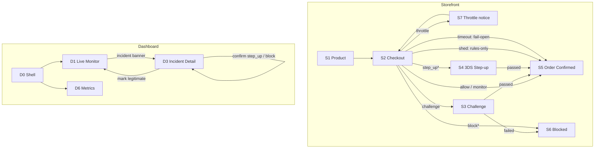

# Tollgate — App Flow

**Version:** v2.0 — 22 August 2026 (supersedes v1.0)
**Companions:** PRD v2 · TRD v2 · Threat Model v2 · Eval Protocol v2

---

## 1. Two applications, three audiences

| App | Port | Who | Purpose |
|---|---|---|---|
| **Storefront** | `:5173` | Shopper (simulated) | The protected surface. Shows that protection is invisible to customers and expensive for attackers. |
| **Dashboard** | `:5174` | Merchant operator | Where risk is observed and acted on. |

**A — the operator-owner.** Needs to know within three seconds whether anything is wrong.
**B — the developer.** Touches only `CONTRACT.md`.
**C — the judge.** Watches both side by side, then the metrics screen.

**Not in v1:** login, signup, user management, multi-store switching, billing. Single-tenant, single-operator. Stated in the README so the absence reads as scoping.

---

## 2. Screen inventory — cut by ~45% from v1

### Storefront (`:5173`)

| ID | Screen | Status |
|---|---|---|
| **S1** | Product page | Build. Minimal — one product, one button. |
| **S2** | Checkout — card form, live latency readout, tier badge (`?demo=1`) | Build |
| **S3** | Challenge interlude — Turnstile-style checkbox | Build. **This is the automatic ceiling**, so it is the tier the demo actually exercises. |
| **S5** | Order confirmed | Build |
| **S6** | Payment blocked | Build |
| **S7** | Throttle notice — a state of S2, not a route | Build |
| **S4** | Step-up (simulated 3DS OTP) | **Cut candidate #2.** Only reachable after operator confirmation, and meaningless on domestic Indian cards where AFA already binds (Threat Model §7a). |
| **DC** | Demo control strip | Build. Judge-facing. |

### Dashboard (`:5174`)

| ID | Screen | Status |
|---|---|---|
| **D0** | Shell — nav + global threat indicator + **advisory-mode banner** | Build |
| **D1** | Live Monitor — default landing | Build |
| **D3** | Incident Detail | Build. The product's centre of gravity. |
| **D6** | Metrics & Evaluation | Build. **Never cut — this is the track's stated bar.** |
| **D2** | Incidents list | Cut candidate #4 — navigate D1 → D3 directly |
| **D4** | Entity drill-down | **Cut from v2 entirely.** The entity table on D3 carries it. |
| **D5** | Policy & thresholds UI | **Cut from v2 entirely.** Thresholds are *derived* from the cost model now (Eval Protocol §1.2), so a slider that hand-sets them actively contradicts the thesis. Config file only. |
| **D7** | Integration | **Cut from v2 entirely.** `CONTRACT.md` carries it; the `scorer_unavailable` counter moves to D0. |
| **D8** | Store profile | **Cut from v2 entirely.** Cold-start banner moves to D1's empty state. |

Cutting D5 is worth dwelling on. In v1 it was a threshold-tuning UI with a live cost curve underneath — the most fun screen in the build. In v2 the thresholds are `θ_T = C_FP(T)/(C_FP(T)+C_FN)`, arithmetic, not preference. A UI that lets an operator drag them somewhere else is a UI for breaking the product's central claim.

---

## 3. Navigation map



`*` = reachable only after operator confirmation on D3.

**Two fail-safe edges are drawn on purpose.** `shed` and `timeout` are distinct paths with distinct causes, and v1 had only the second. Drawing the degraded rung in the navigation map is what stops it being forgotten in the build.

---

## 4. Decision → screen mapping (fixes the six/seven contradiction)

`Decision` has **six** members. The storefront renders **eight** outcomes, because two of them are not decisions at all — they are what the client does when it doesn't get one.

| Value | Source | Storefront result | Shopper sees | Friction cost |
|---|---|---|---|---|
| `allow` | Decision | Proceed to gateway | Nothing | None |
| `monitor` | Decision | Proceed to gateway | Nothing | None |
| `throttle` | Decision | S7 → retry after delay | "One moment…" | Seconds |
| `challenge` | Decision | S3 | Checkbox | ~5 s |
| `step_up` | Decision *(operator-confirmed only)* | S4 | OTP entry | ~30 s, some drop-off |
| `block` | Decision *(operator-confirmed only)* | S6 | Refusal + support contact | Full order value |
| `shed` | **Client-observed** — `X-Tollgate-Shed: 1` | Proceed to gateway | Nothing | None (rules-only rung) |
| `fail_open` | **Client-observed** — timeout / 5xx | Proceed to gateway | Nothing | None |

v1's Phase 0 test asserted a six-member enum while its Phase 13 test parametrized over "all seven decision values." Neither was wrong about the world; they were describing two different sets and calling both `decision`. v2 defines `Decision` (6) and `ClientOutcome` (8) in one module, and a test asserts `set(UI_ROUTING_TABLE.keys()) == set(ClientOutcome)`. The contradiction is now unrepresentable rather than merely resolved.

`monitor` and `allow` are visually identical to the shopper by design — the difference exists only in the dashboard. That is what "invisible to legitimate customers" means concretely, and it is worth saying aloud during the demo.

**v2.1 — two corrections.**

1. **Wire shape.** The `/v1/score` response body carries `decision` only — never `client_outcome`. `shed` is signalled by the `X-Tollgate-Shed: 1` header and `fail_open` by a timeout/5xx/connection error; neither can be a body field. `ClientOutcome` is produced client-side by a single pure function, `resolve_client_outcome(status, headers, body, error)`, in `packages/contracts`, which is the sole authority for all eight rows above and is exercised by the acceptance suite across all eight values — including the header and timeout paths a body field could never reach.
2. **Day 1 reachable subset.** On Day 1, only `allow` / `monitor` / `throttle` / `challenge` are reachable: the auto-ceiling (Threat Model §4/P1) already forbids automatic `block`/`step_up`, and the operator-confirmation UI (D3) doesn't exist until Day 8. `shed` and `fail_open` are reachable from Day 1 (the rules-only rung and fail-open path are scorer-level, not UI-level), but S4/S6's confirmed-tier screens have no live route until later.

---

## 5. Screen specifications

### D0 — Shell

Left nav (three items now: Live, Incidents, Metrics), global threat indicator, and two banners that only appear when they matter:

- **Advisory mode** — "Enforcement paused: blast-radius cap reached (10 entities). Scoring continues." Amber, dismissible only by resolving incidents. This is Threat Model §4/P2 made visible.
- **Degraded mode** — "Rules-only scoring: request rate above budget" / "Scorer unreachable: checkout proceeding unscored (N attempts)". Carries the `scorer_unavailable` and `requests_shed` counters that used to live on D7.

### D1 — Live Monitor *(default landing)*

**Answers in three seconds: is anything wrong right now?**

- **Threat band** — Calm / Elevated / Under Attack. Colour *plus* text label, never colour alone.
- **Four counters** — attempts (5 m), decline rate vs. baseline in sigmas, distinct cards per top entity as a **store-relative quantile** (not a raw count — see TRD §6.2), active enforcement count against `K_max`. **Day-2 states (Decisions.md decision 35):** attempts (5 m) is live, counted in event time so it reads correctly under 60× replay; decline rate and enforcement render `—` with a caption naming the day they light up (Day 7, Day 6); cards-per-top-entity renders as a raw count (not yet the quantile) captioned "store-relative quantile · Day 5".
- **One sparkline** — attempt volume over 60 virtual minutes with the learned baseline band drawn behind it. *The deviation is the story, not the absolute number.* (v1 had twin sparklines; one is enough and the second cost an hour.)
- **Live event ticker** — scored attempts, colour-coded by tier, pseudonymised identifiers only.
- **Incident banner** — the primary route into D3.

**Empty state:** "No incidents. Baseline learned from 4,210 attempts over 6 days." Absence of alarms must never be ambiguous with absence of function. Before the baseline stabilises this becomes the cold-start banner: "Rules-only detection active while the baseline forms."

### D3 — Incident Detail *(the centre of gravity)*

Five stacked sections. The ordering is deliberate, and section 5 is new.

1. **The narrative** — plain-language summary, largest type on the page, prefixed *"Generated summary. The evidence below is authoritative."* Plain text, no markdown, no links, 600-character cap. Renders from the template backend if the LLM is unavailable, with no visible difference in layout.

2. **The action bar** — the recommended tier **from the policy engine** as a primary button. `step_up` and `block` render as *"Confirm block"* with an explicit consequence line, because they are never automatic. Plus manual override and **"This was legitimate"**, which closes the incident as a false positive and releases enforcement.

3. **The evidence** — attempt timeline with the alert point marked and **which detector fired** (CUSUM or distinct-card drift); top feature contributions as a horizontal bar chart; decline-code composition **with the outcome-coverage ratio beside it** so a censored window is visible rather than misleading; entity table with pseudonyms and real keys side by side.

4. **The audit trail** — every tier transition with timestamp, trigger, and the pinned policy version.

5. **Client-asserted evidence** *(new, collapsed by default)* — user agent, device id, checkout path, time on site, under a header reading *"Client-asserted, unverified. Not used in scoring."* This section exists to make the trust boundary visible to a judge who is looking for it, and to stop anyone quietly promoting these values into features later.

### D6 — Metrics & Evaluation *(demo Act Two)*

Renders committed artifacts from `eval/outputs/`. **Six blocks, ordered as the argument should be delivered:**

1. **Per-tier performance** — `recall @ FPR = 0.001` for easy / medium / hard / **evasive**, side by side, because PR-AUC is prevalence-dependent and the tiers have different densities. PR-AUC appears within each tier with that tier's prevalence printed beside it. *The visible degradation is the credibility exhibit.*
2. **Negative-control false positives** — per named scenario, including genuine foreign-issued traffic and the legitimate-customer-on-attacker's-CGNAT-IP case.
3. **The discriminability audit** — univariate AUC per feature, with anything above 0.95 flagged as a probable simulator artifact. *This is the block that answers "did you build the attack to be catchable?"* and it is the most persuasive thing on the screen, because it is a test the author would fail if they were cheating.
4. **The cost curves** — expected ₹ per 10,000 attempts across thresholds, drawn at both prevalence regimes, with the sensitivity ribbon across π ∈ [1e-4, 1e-2], the F1-optimal and cost-optimal points marked, and the regime-switch saving stated.
5. **Calibration** — reliability at both regimes, Brier and ECE for {raw, Platt, Platt+prior-correction}.
6. **Baseline comparison** — naive velocity rule and BIN-concentration rule beside the model, on every tier.

Static render. No live computation on stage.

### S2 — Checkout

Standard card form. Two demo-only additions behind `?demo=1`: a live latency readout for `/v1/score`, and a tier badge showing what came back — including `shed` and `fail_open`, which are the two states a judge will ask about.

### DC — Demo control strip

Persistent overlay. Attack tier selector (easy / medium / hard / **evasive**) with launch. Negative-control selector with launch. Replay speed selector. **Kill-scorer toggle** *and* **flood toggle** — two separate buttons for two separate rungs. Reset.

**Day-2 subset (Decisions.md decision 36):** only the tier selector (all four shown, `medium`/`evasive` disabled with a "Day 4"/"Day 7" label), Launch, Stop, Reset, and a speed selector (`0`/`1`/`60`) are built. The negative-control selector and both degradation toggles are *omitted*, not stubbed, until Day 4/Day 7.

The compression factor is permanently on screen, and in v2 it says something stronger. **Canonical component copy (C6, resolved): UIUX v2 §6.12's exact string —**

> **×60 VIRTUAL CLOCK · WINDOWS PRESERVED · TTD IN EVENT TIME**

v1's banner drew attention to a real problem (60× replay compressed five minutes of window into five seconds, so demo detection wasn't production detection). v2's banner draws attention to the fix.

---

## 6. User journeys

### J2 — Daily check (operator, ~5 seconds)
Open dashboard → D1 → threat band reads Calm → close. The most common journey, and the one most often designed badly. If the operator has to interpret anything to conclude "fine," D1 has failed.

### J3 — Attack in progress *(the journey the product exists for)*
```
Incident fires
  → D1 banner
  → D3
  → read narrative (no score interpretation required)
  → confirm recommended tier  [challenge applies immediately;
                               block/step_up require this click]
  → watch attempts collapse on the live timeline
  → incident auto-transitions COOLING → CLOSED
```
**Target: under 60 seconds from banner to action**, requiring no risk expertise. That target is why the narrative sits at the top in the largest type.

### J4 — False-positive recovery *(the trust-critical journey)*
```
Incident fires on a flash sale
  → D3 → narrative hedges: "high volume across many distinct entities,
    low BIN concentration — consistent with a legitimate traffic surge"
  → operator clicks "This was legitimate"
  → incident closes marked FP, enforcement released immediately
```
v1 routed this to D5 with thresholds pre-loaded. D5 no longer exists, and that is the right outcome: thresholds are derived from cost parameters, so the correct response to a false positive is to revisit the *cost model*, not to drag a slider. The FP is recorded and feeds the report.

This journey is why enforcement is entity-scoped and why the auto-ceiling is `challenge`. **A false positive during a flash sale costs a CAPTCHA, never an order.** If this journey ends with the operator disabling Tollgate, the product has failed regardless of its precision score.

### J6 — Demo Act One (judge, ~3 minutes)

```
Split screen: storefront left, dashboard right

1. Normal traffic. D1 Calm. A real checkout completes, latency badge visible.
2. DC: launch HARD tier at 60× (virtual-clock banner on screen).
3. D1 counters move; decline rate departs the baseline band; threat band → Elevated. **Annotated (Decisions.md decision 34, C8):** Day 2's Act One cannot show the decline-rate beat — it needs `/v1/outcome` (Day 7). Day 2's exit demo instead shows attempts (5 m) climbing and the threat band moving `Calm → Elevated → Under Attack`, driven by `threat_state` on the SSE event; it runs the **easy** tier (hard-tier detectability is measured, not required, on Day 2 — Day-2 Plan §C).
4. Incident fires. Banner → D3. Read the narrative aloud.
5. Confirm the recommended tier. Attack traffic starts hitting S3.
6. ★ A legitimate customer completes checkout FROM THE SAME CGNAT IP
   the attacker is using. They see one checkbox. They get their order.
7. DC: flood toggle → D0 shows "rules-only scoring", checkout still completes,
   attack traffic still challenged.        ← degraded rung, not a bypass
8. DC: kill scorer → D0 shows "scorer unreachable", checkout completes.
                                            ← fail-open, proven
```

**Step 6 is the demo, and it changed.** v1's version put the legitimate customer on a different IP from the attacker — which meant the money shot quietly avoided the hard case (shared infrastructure) instead of demonstrating it. Putting them on the same CGNAT IP is only survivable because of three v2 decisions working together: the composite `(ip, ua_class)` entity key, store-relative quantile thresholds instead of absolute counts, and the `challenge` auto-ceiling that a human passes and a script does not. Demonstrating those three at once, in one frame, is worth more than any number on Act Two.

**Steps 7 and 8 are two rungs, not one.** v1 had only "kill the scorer," which meant the honest answer to "what if I just flood you?" was *you get an unprotected checkout*. Showing the middle rung is what makes the availability posture defensible rather than merely stated.

### J7 — Demo Act Two (judge, ~2 minutes)

D6 only. Walk the six blocks in order. **Close on the cost curve** — but on the *regime pair*, not a single number:

> *"At steady state, one threshold. Under attack, the prior moves by three orders of magnitude and every threshold moves with it. Same model, same features — ₹X less cost per ten thousand attempts, because the decision rule knows which regime it's in."*

That sentence is the thesis. v1's closing number was a single rupee gap computed at whatever prevalence the simulator happened to emit, which a sharp judge would have taken apart in one question.

---

## 7. Cross-cutting behaviours

| Behaviour | Rule |
|---|---|
| **Real-time updates** | SSE on D1 and D3. Native reconnect; 5 s polling fallback. |
| **Notifications** | In-dashboard toast; browser notification when an incident opens and the tab is backgrounded. |
| **Loading states** | Skeletons, never spinners on D1 — a blank monitor is indistinguishable from a calm one. |
| **Error states** | Degrade to last-known-good with a staleness timestamp, never an error page. |
| **Narrator failure** | Template narrative renders. No visible error, no empty section, no layout shift. |
| **Identifiers** | Pseudonyms (`ip_1`, `bin_A`) in the narrative; truncated hashes in tables with copy-full on click. No PAN, email, or phone anywhere in the UI. |
| **Client-asserted data** | Always under an explicit header saying it is unverified and unused in scoring. |
| **Colour** | Never load-bearing. Every state carries a text label. |
| **Time** | Store-local with an explicit IST label; **event time in the demo**, with the virtual-clock factor always visible. |

---

## 8. Build order

| Day | Screens |
|---|---|
| **1** | S2 (ugly), D1 ticker only — **part of the walking skeleton, not a UI day** |
| **2** | D1 threat band + counters, DC strip. *Act One is demonstrable, if ugly, tonight.* |
| **7** | Design tokens (1 h, end of day) |
| **8** | D0 banners, D3 full, D6 |
| **9** | S1/S3/S5/S6/S7 polish, rehearsals |

**The change from v1:** screens no longer arrive on days 7–9 with the first end-to-end run on day 8. A crude D1 and a crude S2 exist on **day 1**, because the thing most likely to kill this build is integration, and integration is only de-risked by doing it early. Everything after day 2 improves a running system.

Corollary, unchanged and still true: never build a policy-tuning UI before the metrics render. In v2 that is enforced by D5 not existing.
