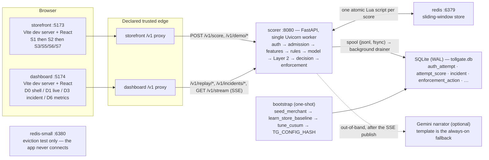

# Tollgate

**Pre-authorization card-testing defence.** Tollgate scores every checkout
attempt *before* the bank authorization call, decides whether to wave it
through, add one friction step, or (only with an operator's confirmation) block
it, and shows a bank-style risk operator what is happening and why — without
ever seeing a card number.

**Status: `DEMO READY`** (Day 9 final audit — `QA-AUDIT-DAY-9-2026-09-03.md`
§23). Two complete demo rehearsals from a clean `docker compose down -v &&
docker compose up --build`, the full J6 flow end-to-end, zero P0, zero
unresolved P1, no manual backend intervention. See **Project status** below and
`PROJECT-PRESENTATION-SCRIPT.md` for the narrated walkthrough.

---

## How it was built (Days 1–9)

Day 1 shipped a rules-only walking skeleton (`POST /v1/score` → auth → rules →
decision → spool → SQLite → SSE → dashboard ticker). Day 2 added a
deterministic, virtual-time-driven attack simulator and replay so the
dashboard's threat band moves against the real scoring path. Day 3 added the
real feature path: a Redis-backed sliding-window store (one atomic Lua script
per score call), the canonical 24-feature definition
(`packages/features/compute.py`), and a template narrator. Day 4 built the
thing that measures the thing that measures traffic: an offline evaluation
harness (`eval/`), validated against four analytically-known sanity scorers
before any real model existed to flatter. Day 5 added Layer 1: a persistent
replay corpus of the exact logged feature vectors, a discriminability audit run
against that real data, an `l1-lgbm-v1` LightGBM detector, a Platt calibrator
with explicit serving-prior correction, and the first real per-tier `eval_run`
rows — the model informs the score, never the decision.

Day 6 added Layer 2 (CUSUM / distinct-card drift → incident state machine →
cost-derived, blast-radius-capped enforcement). Day 7 added the security
posture the Threat Model promises — merchant-scoped admission control with a
rules-only shed rung, a fail-open ladder that always returns `allow`,
`POST /v1/outcome` (HMAC + nonce + 5-minute staleness), the stored-decision
replay reply, a single narrator admission boundary, and **Tier E**: an adaptive
adversary tuned by a seeded parameter search against the frozen detector.
**Day 8** built the operator surface — a plain-CSS design token layer, the D0
dashboard shell (Stream Rail + three monochrome system-state banners →
SSE→5s-polling→SSE recovery), D3 Incident Detail with an operator confirm /
resolve API, D6 Metrics rendered entirely from a committed evaluation artifact
(zero live computation), the storefront's S1/S3/S5/S6/S7 screens, and the
**Gemini narrator** behind `NARRATOR_BACKEND` with the template as an
always-available fallback.

**Day 9** turned the repository into a release candidate: it built the real
`docker compose up` one-command deployment path (Decision 109 — the spec named
it, the repo never had it), built App Flow **J6 steps 6–8** (CGNAT co-tenant,
flood → shed, scorer fault → fail-open) on real code paths behind
`TOLLGATE_DEMO_CONTROLS=1`, then ran eleven QA phases + two full demo
rehearsals to the **DEMO READY** verdict. `/v1/stream` authentication stays
re-deferred (Decision 94 — a documented known limitation).

See `Flow.md` for the actual execution paths, `Decisions.md` for the reasoning
behind them, `DAY-9-DEMO-SCRIPT.md` for the terse operator card,
`PROJECT-PRESENTATION-SCRIPT.md` for the full narrated version, and
`DEPLOYMENT-GUIDE.md` for taking it to AWS.

## Project status

| | |
|---|---|
| **Verdict** | `DEMO READY` — `QA-AUDIT-DAY-9-2026-09-03.md` §23 |
| **Branch / HEAD** | `day-9` @ `ad86715` (Day 9 final) |
| **Defects** | P0 = 0 · P1 = 0 unresolved (2 found + fixed this cycle) · P2 = 2 (1 resolved by Decision 110, 1 documented known limitation with proven-zero metric impact) · P3 = 5 fixed / 4 documented |
| **Stop conditions** | S-1…S-6 each checked individually — **none triggered** |
| **Blocking gates** | `pytest` 643 pass / 1 known-red / 2 xfail · `vitest` 205 · `playwright` 68 · `verify_60x --gate 60x --faulthandler` 9/9 · `--gate crossing` PASS · `--gate throughput` correctness sub-checks PASS (speed sub-check advisory, Decision 110) · `diff_d6.py` 0 substantive diffs |
| **Rehearsals** | 2 × full J6 flow from clean Compose state, identical results, no manual intervention (`DAY-9-DEMO-REHEARSAL-1.md`, `-2.md`) |

The two documented exceptions to "all gates green" are:
`test_d6_provenance::test_corpus_identity` (a permanent RED — a byte-hash check
on a non-deterministically-built, gitignored 18 MB corpus; **zero metric
impact, proven** by regeneration + `diff_d6.py`; DEF-D9-003), and the
`verify_60x --gate throughput` **speed** sub-check `throughput_ok` (advisory on
the reference machine per Decision 110 — `/v1/score` compute p99 = 12 ms, well
inside the TRD's 100 ms budget). Neither blocks the verdict. Full list under
**Known limitations** below.

## Architecture

Six containers (`docker-compose.yml`), started in dependency order:



| Component | What it is | State it owns | If it fails |
|---|---|---|---|
| **storefront** (`services/storefront`, `:5173`) | Vite dev server + React. Merchant checkout: `S1 → S2 → {S3 challenge \| S5 confirmed \| S6 blocked \| S7 throttled}`. `S4` (3DS) is not built (unreachable without a confirmed `step_up`). The PAN never leaves the browser — only BIN, last-4, expiry and a SHA-256 `card_hash` are sent. | screen state only | the shopper can't check out; the scorer and dashboard are unaffected |
| **dashboard** (`services/dashboard`, `:5174`) | Vite dev server + React. `D0` shell (nav + Stream Rail + system-state banners), `D1` live (threat band + 4 tiles + event ticker + demo control strip), `D3` incident read model, `D6` metrics (static import of `eval/outputs/d6.json`). | ephemeral UI state; reconstructs from SSE back-fill on refresh | operator loses visibility; scoring/enforcement continue |
| **scorer** (`services/scorer`, `:8080`) | FastAPI, **one Uvicorn worker** (Decision 71/87 — in-process token bucket, availability monitor, decision cache, replay driver, incident registry, policy engine). Owns `POST /v1/score`, `/v1/replay/*`, `/v1/incidents/*`, `/v1/outcome`, `/v1/stream`, `/v1/demo/*` (gated). | in-process caches + the `WindowStore` fallback when Redis is down | `/v1/score` **fails open** to `allow` (never 5xx); a sustained breach logs `ERROR` + raises one `alert` per window |
| **redis** (`:6379`) | Sliding-window store. One `EVALSHA windows.lua` per score call does every ZADD/ZREMRANGEBYSCORE/ZCARD/SADD/INCR/HINCRBY atomically (TRD §6.3, one round trip). | all window / CUSUM-bucket / idempotency / shed-counter keys (TTL'd) | scorer logs a fallback notice and runs on `InMemoryWindowStore` (single-process, not restart-durable); or, mid-request, `/v1/score` fails open |
| **SQLite** (`tollgate.db`, WAL) | System of record. Written only through the spool → background drainer path, never on the request thread. | every persisted row: `auth_attempt`, `attempt_score`, `incident`, `incident_entity`, `tier_transition`, `enforcement_action`, `narrator_call`, … | scoring is decoupled — the score path writes the spool (fsync'd) and returns; the drainer catches up when the DB is writable again |
| **bootstrap** (one-shot) | `scripts/compose_bootstrap.py`: `seed_merchant` → `learn_store_baseline` → `tune_cusum`, idempotent + footgun-safe, then writes `deploy/compose.env` (merchant API key + `TOLLGATE_OUTCOME_SECRET` + `TG_CONFIG_HASH`). | writes `tollgate.db` (merchant, `store_baseline`, `policy_config`) + `deploy/compose.env` | the scorer's `depends_on: service_completed_successfully` blocks — the stack won't come up with a half-bootstrap |
| **redis-small** (`:6380`) | `maxmemory 2mb`, `allkeys-lru`. Exists **only** for `test_redis_eviction.py`. | — | the application never connects to it |

**Detection pipeline inside `score_attempt()`** (`services/scorer/scoring.py`),
all inside the latency-measured window, all before the single terminal
`await event_bus.publish`:

```
auth (X-Tollgate-Key → merchant_id; never fails open)
  → resolve_client_ip (peer, or XFF only from the declared trusted edge)
  → admission (per-merchant token bucket) ──empty──▶ RULES-ONLY / SHED rung
  → compute_features  (one store.score_path() round trip → 24 canonical features)
  → DayOneRules R1/R2/R3  (attempts_per_ip_60s ≥ 20 · distinct_cards_per_ip_5m ≥ 15 · distinct_cards_per_bin_5m ≥ 20)
  → Layer 2a  CUSUM  (one-sided Poisson CUSUM over τ_flag-gated counts / 10 s bucket → alarm regime)
  → Layer 1  l1-lgbm-v1  (LightGBM margin → Platt calibration + serving-prior correction → score_calibrated)
  → Layer 2b  drift SPRT  (one-sided Wald SPRT on 95th-pctile exceedance of distinct_cards_per_ip_30m per ip / ipua)
  → incident state machine  (OPEN → ESCALATED → COOLING → CLOSED; re-fire in cooldown merges)
  → PolicyEngine.resolve  (entity resolution card→ipua→ip; cost-derived tier ladder; hysteresis;
                           challenge auto-ceiling; K_max advisory mode; 1-per-block-of-20 control arm)
  → decision  (never automatically above `challenge`; `step_up`/`block` need an operator confirm)
  → spool append  (attempt + score + any incident/enforcement rows)  → SSE publish
  → [out of band, after publish] optional Gemini narration; template narrative already stored
```

The score path never blocks on an LLM, never blocks on SQLite, and — via the
fail-open wrapper — never returns a 5xx.

## Operator surface (Day 8)

The dashboard (`services/dashboard`, port `5174`) and storefront
(`services/storefront`, port `5173`) are two Vite + React apps with a plain-CSS
design-token layer (dark `.tg-app` / light `.st-app` — no Tailwind, Decision
95). The dashboard shell carries the **Stream Rail** on every screen (sized by a
`ResizeObserver`, DPR-aware, pitch derived from the viewport so the buffer spans
the canvas at any width), the **threat band** (renders `threat_state` verbatim;
text label + distinct ring glyph, never colour alone), and up to three
**monochrome** system-state banners (advisory mode / rules-only shedding /
fail-open — Tollgate's own health is never a threat colour).

On mount the dashboard opens the SSE stream **and** back-fills
`GET /v1/stream/recent` concurrently, queueing live frames until the back-fill
resolves and merging through a de-duplicating set — so a dashboard opened or
refreshed mid-attack reconstructs the true state rather than showing an
all-clear screen. The connection chip reads `connecting` → `live`; `polling` and
`reconnecting` are reserved for real degradation (SSE drops fall back to
5-second polling of `GET /v1/stream/recent?after=<attempt_uid>`).
`prefers-reduced-motion` freezes the rail (static snapshot) and the ticker.

- **D3 Incident Detail** — `GET /v1/incidents/{id}` returns the read model
  (narrative, detection timeline, contribution bars, entity table, audit trail,
  collapsed client-asserted panel). Pseudonyms plus truncated real keys — never
  a PAN, never a full card hash. A proposed `step_up` / `block` renders as a
  *Confirm* button with an inline cost line; `POST /v1/incidents/{id}/confirm
  {action_id, tier}` records the confirmation and raises that entity's ceiling
  in the live `PolicyEngine`. **"This was legitimate"** →
  `POST /v1/incidents/{id}/resolve {resolution}` closes the incident, releases
  every enforcement row, and restores the `challenge` ceiling.

  **Scoped limitation (Decision 99):** confirmation affects **subsequent**
  attempts from that entity only. It does not retroactively change attempts
  already scored, and the enforcement ledger's `expires_at` TTL still governs
  expiry.

- **D6 Metrics** — renders from the committed `eval/outputs/d6.json` with a
  build-time `import` (no `fetch`, zero live computation). Regenerate it with:

  ```
  uv run python -m eval.harness --split all --seed 42 \
      --corpus-db data/corpus/tollgate.db --model-dir models/
  ```

  (`eval/outputs/d6.json` is committed — `.gitignore` carries a
  `!eval/outputs/d6.json` exception.) The block-4 **rupee gap** is
  `cost(F1-optimal) − cost(cost-optimal)` at π₀ (steady-state prevalence), in
  integer minor units, with `c_fn_minor`, `c_fp_minor("challenge")` and both
  operating points emitted so it is hand-checkable from the artifact alone
  (Decision 100). For `l1-lgbm-v1` at π₀ the two optima coincide, so the gap is
  ₹0 and the headline number is the `regime_switch_saving_minor`.

- **Storefront** — `S1 → S2 → {S5 | S3 | S6 | S7}` (S3 passed → S5, failed →
  S6; S7 returns to S2). `S4` is not built. `lib/outcome.js` is a direct port
  of `packages/contracts/decision.py`'s `resolve_client_outcome()` +
  `UI_ROUTING_TABLE`. `?demo=1` on S2 shows a live `/v1/score` latency readout
  and a tier badge that includes `shed` and `fail_open`.

### The Gemini narrator

```
cp .env.example .env          # then set NARRATOR_BACKEND=gemini and GEMINI_API_KEY
uv run uvicorn services.scorer.app:create_app --factory --port 8080
```

The scorer loads a repo-root `.env` at startup (`packages/config/env.py`,
`override=False` — a real `KEY=val uvicorn ...` prefix or `export` still wins,
so the old inline form keeps working). With no `.env` and nothing exported the
narrator stays on the template. A misconfiguration — `NARRATOR_BACKEND=gemini`
with no key, an unknown backend — is logged as a `config:` warning at startup
instead of silently falling back.

- `NARRATOR_BACKEND` (default `template`) selects the backend. With `gemini`
  and a `GEMINI_API_KEY`, a Gemini call is dispatched **out of band** — after
  the terminal SSE publish, never inside `_resolve_layer2`, never in the
  scoring hot path (Decision 98). The template narrative is written first and
  is the always-available fallback; invalid JSON, a 429, a timeout, a
  connection failure, or a charset violation all leave the template narrative
  intact and the operator sees no error.
- `GEMINI_MODELS` (comma-separated, default `gemini-2.0-flash,gemini-1.5-flash`)
  is an in-order fallback chain: a model that returns HTTP 404/400 advances to
  the next; any other fault falls straight back to the template. The legacy
  single `GEMINI_MODEL` is still honoured.
- `NARRATOR_ENABLED=false` disables Gemini entirely (the template is used).
  The evaluation harness forces this — a harness run makes **zero** Gemini
  calls.
- A `narrator_call` row is written for **every narration attempt**, success or
  failure (`backend`, `status`, `latency_ms`, `fallback_used`). `narrator_call.
  incident_id` is `NOT NULL`, so the reading is one row per *narration*
  attempt, not per scored attempt (Decision 97).
- Never sends a raw identifier or a C-class value: the only free string in the
  request body is `assemble_prompt(bundle)`, already charset-gated and built
  from a closed vocabulary.

## Local setup

### Docker Compose — the supported one-command path

**Prerequisites:** Docker Desktop ≥ 29 with Compose v2 (`docker compose version`),
~2 GB free disk, ports `5173 / 5174 / 8080 / 6379 / 6380` free. Nothing else —
no local Python or Node needed for this path.

```bash
docker compose down -v          # true clean slate (wipes the tollgate_data volume)
docker compose up --build       # ~20–90 s to all-healthy
```

Brings up, in dependency order with healthchecks: `redis` → one-shot
`bootstrap` (exits 0) → `scorer` (`/healthz` healthy) → `storefront` +
`dashboard`. `redis-small` starts alongside and is used by one eviction test
only.

| URL | What |
|---|---|
| `http://localhost:5173/?demo=1` | **storefront** — Kesar & Co. checkout (`?demo=1` adds the latency readout + co-tenant button) |
| `http://localhost:5174/` | **dashboard** — risk operator console; press **Launch** in the bottom control strip |
| `http://localhost:8080/healthz` | scorer health — `{"status":"ok","drainer_alive":true,...}` |

**Startup / bootstrap behaviour.** `bootstrap` (`scripts/compose_bootstrap.py`)
runs `seed_merchant → learn_store_baseline → tune_cusum` idempotently and writes
`deploy/compose.env` (gitignored; `deploy/compose.env.example` documents the
shape) with the demo API key, `TOLLGATE_OUTCOME_SECRET`, and `TG_CONFIG_HASH`.
It is footgun-safe: with an existing `merchant` row it reuses a key that hashes
to the stored one, or fails loudly — it never prints a dead key. The scorer and
both frontends source `deploy/compose.env` **at container start** (the scorer in
its Dockerfile `CMD`, the frontends in their compose `command:` — DEF-D9-011),
because Compose resolves `env_file:` before `bootstrap` runs. A healthy scorer
log shows `Connected to Redis … RedisWindowStore`, `loaded Layer-1 model
l1-lgbm-v1 + calibrator platt-v1`, and `loaded Layer 2 for merchant_demo:
policy v2, cusum_h=318.133, tau_flag=0.06475, drift_enabled=True`.

**Stop / reset.**

```bash
docker compose stop             # pause; state on the tollgate_data volume survives
docker compose down             # remove containers; volume survives
docker compose down -v          # remove containers AND the volume — the only true reset
```

Between takes of the same demo, the dashboard's **Reset** button
(`POST /v1/replay/reset`) is enough — it clears windows, incidents, threat
state, the decision cache, and releases enforcement, and returns Redis to its
key floor.

**Storage.** The repo is bind-mounted into every container (dev-parity).
`models/`, `config/` and the 18 MB `data/corpus/` reference DB stay host-side.
The **mutable** demo DB + spool live on the `tollgate_data` named volume —
SQLite's WAL `-shm` file cannot be mmap'd over a Docker Desktop Windows bind
mount, and a named volume fixes it with no journal-mode change.

**Config seams** (all default to the manual-path behaviour when unset):
`TOLLGATE_SCORER_URL` (Vite `/v1` proxy target), `TOLLGATE_TRUSTED_EDGE_HOSTS`
(comma-separated hosts *added to* the built-in `{127.0.0.1, ::1, testclient}` —
the Compose stack lists the two Vite proxy container IPs), `TOLLGATE_DB_PATH` /
`TOLLGATE_SPOOL_DIR`, `TOLLGATE_DEMO_CONTROLS` (`1` enables `/v1/demo/*` and the
proxy's `x-tg-demo-xff → X-Forwarded-For` promotion; default off → those routes
404).

### Manual path (unchanged — no Docker for the app, Redis optional)

```
uv sync --extra dev
docker compose up -d redis                     # Day 3: the WindowStore backend
uv run python -m scripts.seed_merchant          # prints a demo API key
uv run python -m scripts.learn_store_baseline --db data/corpus/tollgate.db --demo-db tollgate.db  # Day 6
uv run python -m scripts.tune_cusum          --db data/corpus/tollgate.db --demo-db tollgate.db  # Day 6
TOLLGATE_REDIS_URL=redis://localhost:6379 \
  uv run uvicorn services.scorer.app:create_app --factory --port 8080
npm --prefix services/dashboard install && npm --prefix services/dashboard run dev   # :5174
npm --prefix services/storefront install && npm --prefix services/storefront run dev # :5173
```

Put the printed API key in `services/dashboard/.env` and
`services/storefront/.env` as `VITE_TOLLGATE_API_KEY=...` (gitignored, never
committed). Open `http://localhost:5174`, press **Launch** in the DC strip —
on an `easy` replay the threat band moves to **UNDER ATTACK**, the
`ENFORCEMENT` tile climbs (`2 / 10`), and Layer 2b opens incidents that
resolve to `challenge`. The `store_baseline` + tuned `policy_config` steps are
required for Layer 2 to load; without them the scorer runs the byte-identical
Day-5 rules+model path.

`scripts.seed_merchant` uses `INSERT OR IGNORE` on the merchant row: if a
merchant already exists it prints a key that was never stored, and every
subsequent request 401s. Re-run it against a **fresh** `tollgate.db`, or delete
the merchant row first.

`TOLLGATE_REDIS_URL` is optional. If it's unset, or Redis is unreachable at
startup, the scorer logs a fallback notice and runs on `InMemoryWindowStore`
instead — same `WindowStore` protocol, single-process only (window state
does not survive a restart and would not be shared across multiple Uvicorn
workers). `docker-compose.yml` also defines a `redis-small` service
(`maxmemory 2mb`, `allkeys-lru`); it exists only for the eviction-vs-TTL
test and the application never connects to it.

The inline `KEY=val` prefixes above (`TOLLGATE_REDIS_URL`, `TOLLGATE_OUTCOME_SECRET`,
the narrator vars) can all instead live in a repo-root `.env` — `cp .env.example
.env` and edit. The scorer loads it once at startup (`packages/config/env.py`,
`override=False` — a real exported variable or an inline prefix still wins).
`.env` is gitignored; only `.env.example` is committed.

## Demo — the J6 flow

The full script is `DAY-9-DEMO-SCRIPT.md` (terse operator card, six acts, ~5 min)
and `PROJECT-PRESENTATION-SCRIPT.md` (the narrated, study-and-deliver version).
Both are derived only from what actually succeeded in the two Day-9 rehearsals
(`DAY-9-DEMO-REHEARSAL-1.md` Pass B and `DAY-9-DEMO-REHEARSAL-2.md`) against the
real Compose stack. Two windows: **storefront** `:5173/?demo=1` on the left,
**dashboard** `:5174` on the right.

| Act | What you do | What it shows |
|---|---|---|
| **1 — normal checkout** | Storefront **Pay ₹1,200** | `POST /v1/score` → `200 allow` in ~15 ms compute; routes to "✓ Order confirmed"; the dashboard ticker gets one `ALLOW` row (pseudonym + truncated IP + BIN, **never a card number**). Protection the shopper never feels. |
| **2 — attack / replay** | Dashboard control strip: tier `easy`, speed `60`, ☑ pace-from-episode → **Launch** | `POST /v1/replay/start` replays a recorded card-testing attack at 60× virtual time (windows real, TTD in **event time**). Threat band `○ CALM → ⟠ ELEVATED`; the `ATTEMPTS · 5 MIN` and `CARDS PER IP` tiles climb; the R1–R3 rule floors fire first. |
| **3 — detection / incident** | Dashboard **Incidents** → newest incident (D3) | Layer 2b's drift SPRT opens **2 `drift` incidents**, `ESCALATED`, `time_to_detect_s ≈ 78` (event time). D3 read model: narrative (pseudonym + closed vocabulary), detection timeline, contribution bars, entity table (`ip_2 · ip · 198.51.100.xxx (truncated)`), audit trail, collapsed client-asserted panel — **no PAN, no full card hash anywhere**. In-force tier `challenge` (auto), `confirmed_by: auto`. The system escalated only to an inconvenience; `block` / `step_up` need an operator confirm. |
| **4 — CGNAT co-tenant** | Storefront **Checkout as CGNAT co-tenant** | `GET /v1/demo/cotenant-ip` returns an IP currently under enforcement; the checkout re-runs with `x-tg-demo-xff: <that IP>`, which the Vite proxy (the declared trusted edge) promotes to `X-Forwarded-For`. The legitimate shopper checks out **from the attacker's own CGNAT IP and is not blocked** — a single clean attempt doesn't cross R1, and the `challenge` auto-ceiling makes `block` unreachable. Nothing special-cased. Optionally: D3 → **"This was legitimate"** closes the incident, releases enforcement, restores the ceiling. |
| **5a — scorer fault → fail-open** | Dashboard strip DEMO group → **Kill scorer** | `POST /v1/demo/fault` flips an in-scorer flag; `/v1/score` then raises before `score_attempt()` → the real fail-open path → `200 allow`, `degraded_reason: fail_open:model`, one `alert` per window, **never a 5xx**. Click again to clear; recovery needs no restart. |
| **5b — flood → shed** | Dashboard strip DEMO group → **Flood** | `POST /v1/demo/flood` starts a real 250-way concurrent `POST /v1/score` load that drains the per-merchant token bucket through the genuine `AdmissionController`, landing traffic on the **rules-only shed rung** (`X-Tollgate-Shed: 1`, no model, no Layer 2). On a single-worker laptop scorer the shed is *intermittent* (DEF-D9-004) — frame it as "the flood's own requests are being shed" (visible in the flood counters / scorer log), not "watch my checkout get throttled". |
| **6 — metrics** | Dashboard **Metrics** (`#/metrics`) | Renders from the committed `eval/outputs/d6.json` — **zero live computation**. Per-tier recall, the B0-beats-the-model honesty, Tier E's `UNRESOLVABLE` FPR point, the 6 excluded features, the cost curve. See **Metrics** below. |

`/v1/demo/*` routes are gated behind `TOLLGATE_DEMO_CONTROLS=1` (set for the demo
services in `docker-compose.yml`); with it unset they return **404** — the demo
surface is invisible in production. Every control drives a real code path — no
control fakes a decision, a tier, or an availability state (stop condition S-3,
not triggered).

## Metrics

D6 renders from the committed `eval/outputs/d6.json` (schema v2, base seed 42,
`config_hash a7db8c61…`). Every figure carries its measurement conditions on
screen; nothing is recomputed at demo time.

### Detection — per-tier `recall@target_fpr` on `temporal_test`

| tier | `l1-lgbm-v1` (model) | B0 (live R1–R3 rules) |
|---|---|---|
| easy | 0.00 | 0.997 |
| medium | 0.973 | 0.985 |
| hard | **0.732** | 0.125 |
| evasive (Tier E) | 0.391 | 0.284 |

Overall ROC-AUC: model 0.889, B0 0.994. **B0 beats the learned model on AP at
every tier** — and the model is decisively better only on `hard`, where B0's
rules fire on 0 of 3 and recall collapses to 0.125. The dashboard says this in
those words; the demo says it out loud. The target-FPR points are all
`UNRESOLVABLE (too few negatives)` on these short single-episode splits — that
too is on screen.

### Calibration (`block5_calibration`)

| regime | ECE raw | ECE Platt | ECE Platt + prior |
|---|---|---|---|
| π₀ = 0.001 (steady state) | 0.262 | 0.070 | **0.0007** |
| π₁ = 0.9 (under attack) | 0.209 | 0.395 | **0.281** |

Prior correction is Eval Protocol §3.2's logit shift by
`ln(π_s/(1−π_s)) − ln(π_t/(1−π_t))`. It helps at π₁ (0.395 → 0.281); at π₀ the
reweighting is extreme (effective n ≈ 760 of 2125) so ECE-at-π₁ is the
well-conditioned criterion.

### Cost (`block4_cost`) — `c_fn_minor = 5200`, `c_fp_minor(challenge) = 1800`

At π₀ = 0.001 the F1-optimal and cost-optimal operating points **coincide**
(precision collapses away from FPR = 0), so the **rupee gap is ₹0 —
structural**, not empirical. The headline number is the
`regime_switch_saving_minor ≈ ₹2,32,145` (23 214 508 minor units) — what
switching operating regime under attack saves. Both operating points and both
cost inputs are emitted in `d6.json`, so it is hand-checkable from the artifact
(Decision 100).

### Discriminability audit (`block3_audit`)

24 canonical features → **6 excluded** by the univariate-AUC > 0.95 gate
(per-IP rate / fan-out counts — "likely simulator artifact"; they stay active
in the R1/R3 rule floors and B0), **14 constant `0.0` un-fed slots**
(`store_baseline` / `bin_metadata` / `/v1/outcome` are other days' work) → the
model runs on **4 live features**. This is why it is weaker than B0 overall and
stronger only where rate/fan-out doesn't carry the signal.

### Live detection (one `easy` / speed 60 / pace replay, real `score_attempt`)

821 / 821 events · decision histogram `{allow: 269, challenge: 552}` — **zero
automatic `block` / `step_up`** (the `challenge` auto-ceiling holds) · 2 `drift`
incidents `ESCALATED` · TTD ≈ 76–78 s **event time** · entity type `ip` only
(never store-wide) · control arm 29 / 821 (deterministic 1-per-block-of-20).

### Performance (Phase 10, Compose stack, reference machine)

| metric | value | target | verdict |
|---|---|---|---|
| `/v1/score` compute **p50 / p95 / p99** (sequential) | 4 / 8 / **12 ms** | p99 < 100 ms (TRD §1) | **met, wide margin** |
| `/v1/score` compute p99 (10-concurrent / burst) | 17 / 59 ms | < 100 ms | met |
| fail-open rung compute p99 | 10 ms (faster — skips model + Layer 2) | — | — |
| round-trip p50 | ~55 ms | — | Windows→container loopback dominates |
| actual 60× replay factor | **≈ 59×** | 60× nominal | marginal, documented (matches the prior audit's 58.5×) |
| memory over 20-run + 3-run soaks | RSS growth **−0.4 / −2.9 MB** | no leak | pass (negative growth) |
| LLM on the scoring path | `narrator_call` = 0 (out of band, Decision 98) | never | pass — LLM off the path |
| `verify_60x --gate throughput` `throughput_ok` | ~305 aps < 400 | ≥ 400 aps | **advisory** (Decision 110 — serial single-client HTTP-loop artefact, not a serving inefficiency) |

## Replay lifecycle — Launch, Stop, Reset, repeat runs

The **backend owns the lifecycle**; the dashboard never derives it from the
event stream (Decision 102). Eight wire states, split into a terminal set
(`idle`, `stopped`, `finished`, `failed` — controls enabled) and a busy set
(`starting`, `running`, `stopping`, `resetting` — controls disabled).

| Route | Auth | Behaviour |
|---|---|---|
| `POST /v1/replay/start` | **key required** | `202` + the snapshot. Mints a fresh `run_id`. From a terminal-but-dirty state it auto-clears first and reports `auto_reset: true` with the per-layer `cleared` map. `409` while busy. |
| `POST /v1/replay/stop` | **key required** | Waits (≤ 2 s) for the loop to acknowledge and returns the TRUE terminal snapshot; on timeout `stopping`, which the poll resolves. Never a stale `running`. |
| `POST /v1/replay/reset` | **key required** | Transactional: cancel → await termination → clear → publish → `idle`. `200` with `cleared` + `degraded`; `409` (state untouched) if the task will not die. |
| `GET /v1/replay/status` | open | The authoritative snapshot. Deliberately unauthenticated (Decision 107) so a refresh reconstructs even when the dashboard key is misconfigured. |

`run_id` is a ULID minted per run and is the frontend's **single reset signal**:
when it changes — including to `null` on Reset — every event-derived surface
(ticker, rail, tiles, band, incidents) reinitialises and re-back-fills. No
component clears itself.

Three transports carry the same snapshot: a `replay_status` **control frame** on
the SSE stream (low latency), the **HTTP response** of every start/stop/reset,
and a **1 s poll** of `/v1/replay/status` while non-terminal. The poll is what
survives a missed frame, a dead task and a page refresh; a snapshot with an
older `updated_at_ms` is ignored, so a late frame cannot move the UI backwards.

**Repeat runs work.** Launch the same tier again and you get a new `run_id` and
a full second run: idempotency keys are namespaced per run
(`tg:{m}:idem:r{run_id}:{digest}`) and `attempt_uid` is run-scoped, so neither
Redis nor SQLite silently swallows a repeat (Decision 103).

**60× demo pacing.** The DC strip's `pace from episode` checkbox (default on)
sends `pace_from: "episode"`: the pre-attack hours are scored at full tilt and
wall-clock pacing engages ~20 s of event time before the episode, so the attack
is visible in seconds instead of after ~3 minutes. Same events, same order, same
virtual times, same decisions — only the sleep changes (Decision 106).

**Error copy.** The strip prefers the server's `detail`, then maps
`401 → "API key rejected — check VITE_TOLLGATE_API_KEY"`,
`409 → "A replay is already running"`, `503 → "Scorer unavailable"`, and a
network failure to `"Cannot reach the scorer"`. Errors clear on the next
success and after 8 s. A partially-failed reset reports which layer is dirty
rather than claiming success.

## Performance and stability gate

`scripts/verify_60x.py` is verification-only (never imported by the service) and
implements the acceptance gates:

```
uv run python -m scripts.verify_60x --gate all --redis redis://localhost:6379/9
uv run python -m scripts.verify_60x --gate 60x --faulthandler       # native-fault path
uv run python -m scripts.verify_60x --gate throughput --out report.json
```

- **60x** — 3 consecutive full `easy` runs at speed 60, reset between, with a
  wall-clock `POST /v1/score` injected at ~50 % of each. That interleaving is
  the one that crosses replay time and serving time, and it is what wedged the
  scorer before the Layer-2 catch-up bound (Decision 108).
- **crossing** — 5 repetitions of both crossing orders; each must complete and
  log a bounded-discontinuity WARNING rather than spin.
- **throughput** — 20 consecutive `easy` runs at speed 0, carrying the
  repeatability and drainer gates: identical event counts, no run swallowed,
  Redis key count back to its floor after every reset, `attempt_score` row
  count == events scored, drainer alive, `connect()` calls ≤ 2 per run.

`TOLLGATE_FAULTHANDLER=1` arms `faulthandler` plus a repeating stack dump. It is
env-gated because the audit's own caveat stands — the two SIGSEGVs it recorded
happened *under* `dump_traceback_later`, so the diagnostic is itself a suspect
and the gate is run both ways.

## Evaluation harness (Day 4)

`eval/` is an offline harness, independent of the live scoring path, that generates simulator
traffic, splits it, scores it with four analytically-known **sanity scorers** (perfect, random,
inverted, always-positive), and renders a report:

```
uv run python -m eval.harness --split all --seed 42 [--seeds 5] [--out eval/outputs/]
cat eval/outputs/report.md
```

- No model, no calibrator exist yet — the four sanity scorers are the "ruler," not a
  detector. `--seeds` defaults to `1` (a stated limitation; the individual acceptance tests
  still verify tolerances across 5 seeds independently — see `Decisions.md` decision 61).
- The report's six blocks (per-tier recall@FPR, negative controls, discriminability audit,
  cost, calibration, baselines) each render an explicit empty/deferred state rather than a
  fabricated number for anything Day 4 cannot yet measure (no incident detector, no
  calibrator, no replay corpus).
- `medium` and (Day 7) `evasive` are real attack tiers (`config/attack_tiers.yaml`) — the
  `evasive` block is populated by the Tier-E search and is no longer `pending`.
- Seven negative-control scenarios exist (`packages/simulator/negative.py`):
  `flash_sale, corporate_nat, cgnat, retry_storm, subscription_batch, nri_traffic,
  shared_ip_legit`. Generate one by hand:
  ```
  uv run python -m packages.simulator.generate --seed 42 --scenario nri_traffic \
      --out data/streams/n.jsonl --labels data/streams/n.labels.jsonl \
      --episodes data/streams/n.eps.jsonl
  ```
  `nri_traffic` is marked **inert** in the report — it controls for `bin_is_foreign_issued`,
  which stays `0.0` until the BIN-metadata join lands (still deferred after Day 5 — see
  `Flow.md` §10). `test_nri_control_tripwire.py` fails the moment that changes.

## Layer 1 (Day 5)

```
uv sync --extra dev
uv run python -m scripts.train_l1 --seed 42 --db data/corpus/tollgate.db --out models/ --rebuild-corpus
uv run python -m eval.harness --split all --seed 42 \
    --corpus-db data/corpus/tollgate.db --model-dir models/ --write-eval-run
cat eval/outputs/report.md
```

- **`eval/corpus.py`** replays the full `build_runs(42)` layout (12 tier blocks + 7
  negative-control scenarios, one merchant per run) through the *identical* `score_attempt`
  core and persists the logged `attempt_score.feature_snapshot` vectors — the training
  corpus. `data/corpus/tollgate.db` is gitignored; rebuild with `--rebuild-corpus`.
- **`scripts/train_l1.py`** builds the corpus, runs the discriminability audit
  (`univariate_auc` over all 24 features on the easy+medium training set — writes
  `models/audit.json`, exits non-zero if a feature over `0.95` is not in
  `config/features.yaml: audit.excluded`), then trains `l1-lgbm-v1` (LightGBM, `objective=
  binary`, 200 trees, `max_depth=6`, `scale_pos_weight = n_neg/n_pos`, `num_threads=1`,
  `deterministic=True`, `seed=42`) and fits the Platt calibrator on a held-out `calib` slice.
- **Committed artifacts:** `models/l1-lgbm-v1.json` (`ModelArtifact`), `models/platt-v1.json`
  (`Calibrator`), `models/audit.json`. The booster (`models/l1-lgbm-v1.txt`) is gitignored
  and regenerated by `train_l1`.
- **Six features are excluded by the audit** (per-IP rate / fan-out counts that are
  near-perfect single-feature discriminators on the training tiers — Eval Protocol §4/V2's
  "likely simulator artifact"). They are zeroed on model input but **stay active in the
  R1/R3 rule floors and B0**. The model therefore runs on 4 live features and, as the report
  states, is weaker than B0 overall (`temporal_test` ROC-AUC 0.889 vs 0.994) and on `easy`,
  but competitive on `medium` and **decisively better on `hard`, where B0 fires 0/3 rules**
  (recall@1e-3 0.73 vs 0.13). See `Decisions.md` decision 64.
- **`eval.harness --write-eval-run`** writes the first real `eval_run` rows
  (`l1-lgbm-v1` on `temporal_test` + the attack-shape holdout, `rules-only-v0` on
  `temporal_test`), idempotent by `run_id`. Report Block 1 gains model + B0 rows, Block 3 is
  the real 24-row audit table, Block 5 is the real calibration table at π₀ and π₁, Block 6
  has the real B0 row. Blocks 2 and 4 are unchanged — `apply_auto_ceiling` and the decision
  rule are untouched; applying `θ_T` to the calibrated posterior is Day 6 (decision 57).
- **Serving:** with a `models/` artifact present, `services/scorer` computes and logs
  `score_raw` / `score_calibrated` / `top_contributors` / `model_version` between rules and
  policy; with no artifact the path is byte-identical to Day 4 (the rules-only fallback).

## Layer 2 + policy (Day 6)

```
uv run python -m scripts.learn_store_baseline --db data/corpus/tollgate.db --demo-db tollgate.db
uv run python -m scripts.tune_cusum          --db data/corpus/tollgate.db --demo-db tollgate.db
uv run python -m scripts.seed_merchant        # if tollgate.db does not exist yet
```

Day 6 makes the system **decide**: entity-scoped, cost-derived,
hysteresis-damped, blast-radius-capped, and **never automatically above
`challenge`** (Threat Model §4/P1).

- **`packages/detect/cusum.py`** — Layer 2a, a one-sided Poisson CUSUM over
  `τ_flag`-gated counts per 10 s bucket. `τ_flag = CostModel.tier_ladder()["throttle"]`
  (≈ 0.0647, *derived*, never a literal — Decision 70). `steps_to_alarm` is the closed form
  the analytic gate checks against; empty buckets decay `S_t` by exactly `(λ₁−λ₀)`.
- **`packages/detect/drift.py`** — Layer 2b, a one-sided Wald SPRT on 95th-percentile
  exceedance of `distinct_cards_per_ip_30m` per `ip` / `ipua` (Decision 73). Toggle with
  `config/policy.yaml: drift.enabled`.
- **`packages/detect/episode.py`** — the incident state machine
  (`OPEN → ESCALATED → COOLING → CLOSED`, `CLOSED` terminal; re-fire in cooldown *merges*).
  Owns the harm fields: `attempts_before_alert`, `cards_exposed_before_alert`,
  `time_to_detect_s` (event time), `cusum_stat_at_alert`, `peak_tier`.
- **`packages/detect/policy.py`** — entity resolution (`card → ipua → ip`, never `asn`;
  store-wide is *unrepresentable*), the cost-derived threshold ladder read from
  `PolicySnapshot.thresholds` (no `eval/` dependency on the serving path), P3 corroboration,
  hysteresis (`θ_T` enter / `θ_T − 0.08` exit), the `challenge` auto-ceiling, `K_max`
  advisory mode, and the deterministic one-per-block-of-20 control arm.
- **`scripts/learn_store_baseline.py`** learns the `store_baseline` row **from the 7
  negative-control runs only**, re-scored through `models/` so `flagged_rate_mean` (p̄₀)
  matches the serving regime (Decision 83). **`scripts/tune_cusum.py`** tunes `cusum_h`
  from those same negative controls (ARL₀ ≥ 8,640 buckets; provenance names every merchant
  it reads — no `kind='attack'` row is ever touched) and writes a new `policy_config`
  version carrying `cusum_h` **and** `thresholds = CostModel.tier_ladder()` (`{0.065,
  0.257, 0.509, 0.874}`).
- **Guarded serving:** `services/scorer/deps.py::_load_layer2` loads the policy / baseline /
  engines exactly like `_load_model`; when a policy or baseline row is absent every
  `attempt_score` and SSE field is **byte-identical to Day 5** (verified: the rebuilt
  corpus's `attempt_score` digest is unchanged). One `store.score_path()` call per score is
  preserved (the 30 m distinct-card window is an 11th `WindowRequest` in the same call).
- **Persistence:** incidents / entities / tier transitions / enforcement actions flow
  through the existing spool → drainer → SQLite path; `enforcement_action` rows for
  `step_up` / `block` carry `confirmed_by IS NULL` and `applied_at IS NULL` (proposed, never
  applied). SSE gains `incident` (pseudonym only), `enforcement` (`active / k_max /
  advisory_mode`), `control_arm`; the D1 `ENFORCEMENT` tile is live and the advisory banner
  renders monochrome at the cap.
- **In practice:** with the weak 4-feature Day-5 model loaded, p̄₀ ≈ 0.60, so Layer 2a is
  conservative and **Layer 2b is the operative Layer-2 detector for `easy` / `medium`**
  (TTD ≈ 76 s in a demo replay). **`hard` is undetected by Layer 2** and is reported as
  such, not tuned around (Decision 83). The R1–R3 rule floors stay active on every tier.
- **Deferred (Day 7+):** Redis-backed CUSUM / enforcement state; `bin_metadata` load / real
  AFA ladder activation; the incident-detail screen / confirmation API / Gemini narrator
  (Day 8); rendering Layer-2 harm metrics into `eval/report.py` (Day 8/9); reinstating the
  `_q` / `*_sigma` / decline model features (Decision 16/64).

## Security posture (Day 7)

Every score request runs one of three rungs, all in `services/scorer/routes_score.py`,
all **outside** the Layer-2 atomic block (so the 100-concurrent-vs-sequential CUSUM
guarantee holds):

Replay control is authenticated: `POST /v1/replay/start`, `/stop` and `/reset`
all require `X-Tollgate-Key` and return `503` (never a bypass) when the auth
backend is unavailable with a cold key cache. `GET /v1/replay/status` is
deliberately open, consistent with `/v1/stream` — see Decision 107.

| Rung | Trigger | Behaviour |
|---|---|---|
| **FULL** | merchant token bucket has a token | `score_attempt()` as Day 6, plus an `availability` field on SSE |
| **RULES-ONLY / SHED** | bucket empty | `INCR tg:{m}:shed:{ip}` (merchant-scoped, 60 s TTL); tier = `throttle` if the counter clears R1's threshold else `allow` (**R1 only**, Decision 15); `X-Tollgate-Shed: 1`; a `shed=True` row; **`compute_features` / model / Layer 2 never run** |
| **FAIL-OPEN** | `score_attempt()` raised (dead Redis, model exploded) | always returns `allow`; a `degraded_reason: fail_open:<reason>` row; a sustained breach logs `ERROR` + raises `alert` on SSE **once per clock window** (that is the rate limit) — never a 5xx, never a different tier |

- **Admission** is a lazy-refill token bucket per `merchant_id` on `ScorerState`, driven by
  the injected clock (`config/policy.yaml: admission:` — `rate_per_s 50`, `burst 200`,
  `shed_ttl_s 60`, `fail_open_alert_threshold 20`). One merchant's flood cannot shed
  another's.
- **Authentication never fails open.** A warm `{api_key_hash → merchant_id}` cache lets a
  locked auth DB still authenticate (then fail-open, merchant-scoped); a cold cache + an
  unavailable DB returns **`503`**, never `allow`.
- **`POST /v1/outcome`** verifies `hmac_sha256(secret, "{merchant_id}\n{ts_ms}\n{nonce}\n
  {sha256(canonical_body)}")`, a 5-minute staleness window, and a single-use nonce
  (`outcome_nonce` PK → `409` on replay). The secret comes from **`TOLLGATE_OUTCOME_SECRET`**
  and is bound to the merchant via the existing `outcome_hmac_key_hash` — no schema change,
  no secret at rest. Unsigned / tampered / stale → `401`; unknown `event_id` → `404`; unset
  secret → `503`. `scripts/seed_merchant.py` now prints the raw outcome secret once.
  `decline_rate_per_ip_5m` and its two siblings still read `0.0` — outcome-derived features
  are out of Day-7 scope.
- **Narrator:** at incident-open only, `build_bundle()` is the single admission point (it
  takes no `user_agent`, no raw identifier, no free text); `assemble_prompt()` runs the
  `CHARSET_RE` gate on the input side; the template narrative is stored on the incident row.
  A hostile UA is kept as evidence in `auth_attempt.client_evidence` but has no path to the
  prompt.
- **Residual risk (Threat Model §4):** a key-holder can force CAPTCHAs on up to `K_max`
  entities and consume the merchant's rate budget; they **cannot** block a customer, cannot
  persist state past the shed TTL, and cannot act invisibly (every degradation writes a
  `degraded_reason` row and, past budget, a paged `alert`).
- **In-process, single-worker:** the token bucket, the availability monitor, and the
  stored-decision cache live on `ScorerState` (Decision 71's trade) — one Uvicorn worker
  only. **Re-deferred past Day 7:** `/v1/stream` authentication (Decision 94).

Run the demo with the outcome route enabled:

```
export TOLLGATE_OUTCOME_SECRET="$(python -m scripts.seed_merchant | sed -n 's/.*TOLLGATE_OUTCOME_SECRET: //p')"
```

### Day-9 security verification (Phase 6 — stop condition S-5 armed, NOT triggered)

48 acceptance tests + 35 live probes against the Compose stack.

- **Client-asserted data reaches nothing.** One maximally-hostile `POST /v1/score`
  (`ip`, `merchant_id`, `attempts_per_ip_60s=999999`, `score_calibrated=0.999`,
  `decision="block"`, `rules_fired`, a PAN, a CVV, a marker in `card_hash`) →
  persisted row: `merchant_id` from the key, `attempts_per_ip_60s=1` (server),
  `score_calibrated=9.57e-05` (real model), `rules_fired=[]`, a server ULID
  `attempt_uid`, **no PAN / CVV key**. Response `allow`, not the injected `block`.
- **Trusted edge.** `X-Forwarded-For` is honoured **only** from a peer in
  `TRUSTED_EDGE_HOSTS`; a non-edge peer's XFF is ignored. `TOLLGATE_TRUSTED_EDGE_HOSTS`
  *adds* the two Vite proxy container IPs under Compose — it does not widen the
  default loopback set.
- **No PAN / CVV / card-hash** on SSE, in D1 / D3, or in scorer logs
  (`card_hash` is never on the stream — Decision 34).
- **Narrator isolation.** `build_bundle()` is a frozen dataclass with a closed
  vocabulary (`__post_init__` raises); `assemble_prompt()` runs the `CHARSET_RE`
  gate; Gemini runs **out of band** after the terminal SSE publish (Decision 98)
  — it **cannot influence enforcement**, and a harness run makes zero Gemini calls.
- **Demo controls** (`/v1/demo/*`) are **404-invisible** without
  `TOLLGATE_DEMO_CONTROLS=1`.
- **Operator actions** authenticated (a well-formed unauthenticated call → `401`
  before any effect); `/v1/replay/status` deliberately open (Decision 107).

## Known limitations

Carried into the demo, each documented; the demo script accounts for each and
none can interrupt, invalidate, or materially undermine the demo.

### Architectural

1. **Single Uvicorn worker only** (Decision 71 / 87). The token bucket,
   availability monitor, decision cache, `InMemoryWindowStore` fallback, replay
   driver, incident registry and policy engine are all in-process. Horizontal
   scale-out of the scorer needs shared state (a redesign) — see
   `DEPLOYMENT-GUIDE.md` §9.
2. **`/v1/stream` is unauthenticated** (Decision 94, re-deferred). Loopback /
   bridge-bound for the demo; it publishes `rules_fired` / `feature_snapshot`,
   which would be a disclosure risk on a public network.
3. **Outcome-derived decline features read `0.0`** (Decision 34 / C8). There is
   no completed authorization outcome on the pre-auth path to derive
   `decline_rate_per_ip_5m` and its two siblings from; the detection above does
   not use them, and the demo does not imply they move.
4. **`bin_metadata` join not landed** — `bin_is_foreign_issued` /
   `foreign_bin_share_5m` stay `0.0`; `nri_traffic` is marked inert in the
   report and `test_nri_control_tripwire.py` fails the moment that changes.
5. **The learned model is weaker than the B0 rules on AP at all four tiers** and
   decisively better only on `hard`. Tier E recall 0.39 (model) / 0.28 (B0),
   target-FPR `UNRESOLVABLE`. 6 features excluded by the discriminability audit →
   4 live. All on screen in the Metrics act — this is a stated finding, not a
   defect.
6. **SQLite + spool + drainer** is a single-writer design. Fine for one scorer;
   a multi-instance deployment needs a shared store (`DEPLOYMENT-GUIDE.md` §9).

### Environment / reference-machine

7. **`verify_60x --gate throughput` speed sub-check `throughput_ok`** fails on
   the Windows + Docker Desktop reference machine (~305 aps vs ≥ 400 — a serial
   single-client HTTP loop bounded by loopback round-trip, not request latency).
   **Advisory** per Decision 110; the correctness / determinism / repeatability
   sub-checks of the same gate stay blocking and green; `/v1/score` compute
   p99 = 12 ms.
8. **60× replay runs at ≈ 59×** on the reference machine (matches the prior
   audit's 58.5×).
9. **Flood → shed is intermittent** on the single-worker laptop scorer
   (DEF-D9-004): the flood sheds ~1/3 of its own requests but does not keep the
   bucket continuously empty, so a lone interactive checkout is shed only
   sometimes and the D0 shed banner may not latch. The shed **rung** is proven
   (`test_admission_shed.py`; 664 / 784 real `X-Tollgate-Shed` responses in the
   two rehearsals). Crisp on a multi-worker deployment.
10. **`test_corpus_identity` is a permanent RED** (DEF-D9-003) — see **Testing**.
    Zero metric impact, proven.

### Demo-surface / polish

11. **Unknown replay `tier`** → `POST /v1/replay/start {"tier":"bogus"}` returns
    `202` then transitions to a recoverable `failed` state, not a boundary `422`
    (DEF-D9-005). Off the demo path — the control strip only sends the four real
    tiers. A `Literal` guard would break the AUDIT-007 async-failure test, so the
    fix is not isolated.
12. **`POST /v1/replay/stop` lags at `speed=1`** (DEF-D9-007) — the run loop
    checks the stop flag only between events. Not the demo speed (60, where
    `stop` acknowledges in ~5 s); `reset` is the immediate fast path at any speed.
13. **`--tg-primary` (`#6366f1`) small text on `#12161b` is 4.06:1** (DEF-D9-009)
    — below WCAG AA 4.5:1 on 3 nav labels + the Launch button. Legible; 21–22
    axe passes otherwise. Retune post-demo.
14. **D3 confirmation is forward-only** (Decision 99) — confirming a `step_up` /
    `block` affects **subsequent** attempts from that entity; it does not
    retroactively re-score, and the enforcement ledger's `expires_at` TTL still
    governs expiry.

## Tier E — adaptive adversary (Day 7)

Every recall number before Day 7 was measured against `easy` / `medium` / `hard`, which
differ only in *pacing and spread* — the exact F5 defect the Threat Model was written to
fix. Tier E closes that: a seeded config-space search (`packages/simulator/evade.py`, pure
and import-safe — it takes the detector as a callback and cannot import the scorer) tunes
the **six parameters `generate_attack_episode` actually consumes** against the **frozen**
Layer-1 + Layer-2 detector.

```
uv run python -m scripts.search_evasive --seed 42 --budget 200 --patience 40 \
    --demo-db tollgate.db --model-dir models/ \
    --write-config config/attack_tiers.yaml --trace eval/outputs/evade_search.json
uv run python -m scripts.search_evasive --append-corpus --seed 42 --db data/corpus/tollgate.db
uv run python -m eval.harness --split all --seed 42 \
    --corpus-db data/corpus/tollgate.db --model-dir models/ --write-eval-run
```

- **Objective** (Eval Protocol §5, verbatim): maximise `cards_validated_per_hour` subject to
  `mean(score_calibrated) < θ_challenge` and no incident opened. `θ_challenge` is read from
  the pinned `policy_config` (`≈ 0.257`), *derived*, never a literal. Randomness is all
  `SubStream(seed, "evade:<field>")`; termination is 200 evaluations **or** 40 non-improving
  candidates.
- **Converged vector (seed 42):** `attempts_per_hour 866`, `ip_pool_size 77`,
  `distinct_cards 286`, `bin_pool_size 19`, `amount_quantile_band [0, 26]`,
  `episode_duration_s 704` — `cards_validated_per_hour ≈ 76.7` while staying under
  `θ_challenge` and opening no incident. The four declared-but-inert leaves
  (`foreign_bin_share`, `amount_sampler`, `session_reuse`, `hour_of_day_placement`) are
  carried at their `hard`-tier values, not searched (Decision 92). Full trace:
  `eval/outputs/evade_search.json`.
- **Result — the worst number in the deck.** On the dedicated `tier_e` split (n = 390,
  prevalence 0.43 — *never* mixed into training or the temporal split, Eval Protocol §7 /
  Decision 93), recall@target_fpr is **0.39 for `l1-lgbm-v1`** and **0.28 for B0** (the live
  R1–R3 rules). The split is short and single-episode, so the target-FPR point is
  `UNRESOLVABLE (too few negatives)` and the report says so. What the attacker had to do to
  evade us — 77 IPs, 19 BINs, low-and-slow pacing — is itself the finding.

## Testing

### The Day-9 blocking gates (final regression — `QA-AUDIT-DAY-9-2026-09-03.md` §20)

| Gate | Command | Day-9 final result |
|---|---|---|
| **Backend** (pytest) | `uv run pytest tests/ -q` | **643 passed / 1 failed / 2 xfailed**. The 1 failure is `test_d6_provenance::test_corpus_identity` (DEF-D9-003 — see below); the 2 xfails are the `handmade_40` human-oracle gates. 0 unexpected failures; all 6 Phase-13 regression guards pass. |
| **Frontend unit** (Vitest) | `npm --prefix services/dashboard run test:run` | **205 passed / 21 files**; coverage 97.9 / 86 / 98.5 / 97.9 (≥ 85 / 85 / 80). |
| **Browser E2E** (Playwright) | `npm --prefix services/dashboard run test:e2e` | **68 passed** — 17 checks × 4 viewports (1536 / 1280 / 768 / 390), incl. every-SVG-text ≥ 11 px, focus-ring, no-console-error, axe. |
| **60× stability + native fault** | `uv run python -m scripts.verify_60x --gate 60x --faulthandler --redis redis://localhost:6379/9` | **PASS 9/9** on a quiet machine (`no_crash` — no SIGSEGV under `dump_traceback_later`, `health_responsive`, `loop_lag_under_2s`, `rss_growth_ok`, `checkout_interleaved`, exact terminal counts, `drainer_alive`). |
| **Time-domain crossing** | `uv run python -m scripts.verify_60x --gate crossing` | **PASS** — 5 reps × both crossing orders, one bounded-discontinuity WARNING each, no spin. |
| **Throughput / repeatability** | `uv run python -m scripts.verify_60x --gate throughput` | **Correctness sub-checks all PASS** — `identical_event_counts=[821]`, `no_run_was_swallowed`, `attempt_score_row_parity`, `redis_returns_to_floor`, `no_degraded_reset`, `drainer_*`, `loop_lag_under_2s`. The one advisory FAIL is `throughput_ok` (~305 aps < 400 — a serial single-client HTTP-loop artefact on the reference machine, **not** a serving inefficiency; `/v1/score` compute p99 = 12 ms; **Decision 110**). `verify_60x.py` is unmodified — no threshold was lowered. |
| **Evaluation reproduction** | regenerate `d6.json` into a scratch dir, then `uv run python scripts/diff_d6.py eval/outputs/d6.json <scratch>/d6.json --ignore provenance` | **0 substantive metric differences**; every block (1–6 + `tier_e`) reproduces bit-for-bit; all four S-6 frozen-artifact SHAs byte-identical to Phase 0 (`d6.json 29edcb22…`, `audit.json ce75cb7f…`, `l1-lgbm-v1.json 7cb7fa8a…`, `platt-v1.json 22dc48f0…`). |

**DEF-D9-003 — the one permanent RED, honestly.** `test_corpus_identity`
asserts `sha256(data/corpus/tollgate.db) == d6.json.provenance.corpus_db_sha256`.
An early Phase-2 bootstrap iteration wrote a wall-clock `store_baseline.updated_at`
into the gitignored 18 MB reference corpus before the corpus-working-copy guard
existed, so the byte hash drifted. **Zero metric impact — proven, not asserted:**
`eval.harness` was regenerated twice (deterministic, A ≡ B) and `diff_d6.py`
shows only two changed leaves, both provenance metadata. The original SHA was
itself a snapshot of a non-byte-deterministic build (`learn_store_baseline`
stamps wall-clock). The test is **not weakened and not deleted** (Plan §8); it
stays RED as a documented known limitation, to be reworked post-Day-9 to hash
only the eval-relevant tables.

### Marked subsets

```
uv run pytest -q                # full suite
uv run pytest -q -m safety      # simulator import-closure / egress safety
uv run pytest -q -m slow        # durability, lock contention, SSE, Day-2 E2E, scenarios A-G
uv run pytest -q -m metamorphic # the M1-M8 Layer-2 relations (Day 6)
uv run pytest -q -m characterization  # informational only, never a gate
uv run pytest -q -m redis       # Day-3 Redis-backed tests; skip cleanly if Redis is down
```

**Hermeticity.** Every test's configuration is a function of its own parameters.
Subprocess-spawning tests hand the child an explicit env ALLOW-LIST plus
`TOLLGATE_SKIP_DOTENV=1` (`tests/acceptance/_scorer_process.py`) — no
`TOLLGATE_*` is ever inherited — and an autouse fixture restores `os.environ`
and `packages.config.env._loaded` around every test. Before this, the first
acceptance test to build an app loaded `.env` into the pytest process, and every
later `_spawn` silently promoted its subprocess from the in-memory store to a
shared Redis: one test decided another test's storage backend, which is why
`test_day2_e2e` passed alone and failed in-suite. It is now parametrised over
both backends explicitly (`memory`, and `redis` against a dedicated logical DB
it flushes itself), so the Redis path is a deliberate gate rather than an
inherited accident:

```
uv run pytest -q tests/acceptance/test_day2_e2e.py           # both backends
uv run pytest -q $(python -c "import pathlib;print(' '.join(sorted((str(p) for p in pathlib.Path('tests').rglob('test_*.py')), reverse=True)))")   # reversed file order
```

The Day-4 evaluation-harness tests (`tests/acceptance/test_harness_sanity.py`,
`test_cost_thresholds.py`, `test_splits.py`, `test_negative_scenarios.py`, and others) run as
part of the full suite with no extra flags or services required. `eval/harness.py` and
`eval/scorers.py` stay stdlib + `pyyaml` and import no `lightgbm`; on Day 5 `eval/corpus.py`
lazily bridges to `services/scorer` to build the replay corpus, and
`eval.harness --model-dir` loads a duck-typed model/calibrator from `packages/detect/`
(which owns the `lightgbm` dependency). The Day-5 corpus/model acceptance tests
(`test_time_travel.py`, `test_discriminability_audit.py`, `test_calibration.py`,
`test_eval_run_row.py`, …) reuse `data/corpus/tollgate.db` + `models/` when present and
otherwise rebuild them once per session (so a fresh clone rebuilds; `uv sync --extra dev`
installs `lightgbm`).

Redis-marked tests read `TOLLGATE_REDIS_URL` (default `redis://localhost:6379`)
and `TOLLGATE_REDIS_SMALL_URL` (default `redis://localhost:6380`, the
eviction test only) and skip — never fail — when unreachable, so
`uv run pytest -q` is green with or without `docker compose up -d` having
been run first.

Day 6 adds `pytest -q -m metamorphic` (the M1–M8 Layer-2 relations) and ~65
new tests (`tests/acceptance/test_{cusum_analytic,episode_state_machine,
hysteresis,blast_radius,control_arm,policy_pinning,metamorphic}.py` and
friends) plus the non-gating characterization snapshot
`tests/characterization/test_incident_shape.py`.

Day 7 adds ~30 new tests: `tests/acceptance/test_{idempotency_concurrency,
concurrent_cusum,admission_shed,fail_open,fail_open_alert,outcome_hmac,
narrator_injection,evade_search}.py`. Two locked tests carry an authorized
edit (`test_attack_tiers.py` — `evasive` no longer `pending`;
`test_eval_run_row.py` — `per_tier` gains `evasive`); `test_time_travel.py`
was extended, not weakened, to also reproduce the appended Tier-E corpus run.
Full suite: **302 passed, 10 skipped (Redis), 2 xfailed** (both `handmade_40`
human-oracle gates — still xfail; not a Day-7 dependency). The Day-6/7
integration acceptance tests seed a throwaway `tmp_path` DB and never touch
the corpus; the Tier-E append is the one deliberate mutation of
`data/corpus/tollgate.db`.

`tests/acceptance/test_handmade_40.py` (Day-3 feature values) **and**
`tests/acceptance/test_handmade_40_incident.py` (the Day-6 incident alert
point — one incident opens at the hand-counted `alert_seq`) both show as
`xfail` in every run until a human supplies `tests/fixtures/handmade_40.
{jsonl,expected.jsonl,sha256}` (the incident gate also reads one extra line,
`{"seq": null, "incident": {"alert_seq": N, ...}}`, from the expected file).
It is the one oracle in the suite that must not be generated by an
implementation agent (Decisions.md decision 14): an agent authoring both the
fixture and its expected values would produce a self-consistent artifact with
zero oracle value. Both `xfail`s become real pass/fail gates the moment the
files land, with no code change required. **`day-6-done` is not tagged until
the incident gate is green against that human fixture.**

## Data attribution

The Day-2 baseline traffic model is grounded in a derived profile of the UCI
Online Retail II dataset:

> Chen, D. (2012). Online Retail II [Dataset]. UCI Machine Learning
> Repository. https://doi.org/10.24432/C5CG6D. Licensed under
> [CC BY 4.0](https://creativecommons.org/licenses/by/4.0/).

Only the derived, integer-only profile (`data/baseline/online_retail_ii.profile.json`,
~12 KB) is committed — see `data/baseline/README.md` for the full grounding
chain and regeneration instructions. The raw dataset is never committed.

## Safety posture

`packages/simulator/` generates synthetic demo traffic only: opaque
identifiers, fictional BINs (a reserved, non-real IIN prefix), and
documentation/example IP ranges (RFC 5737). It never constructs real card
numbers, never performs Luhn validation, and never opens a network
connection or subprocess (`tests/acceptance/test_simulator_safety.py`
enforces this both statically — an AST import-closure scan — and at
runtime, by monkeypatching `socket.socket` to raise during a full
generation run and asserting it still succeeds). `/v1/stream` is
unauthenticated and binds loopback only for the demo; it publishes rule-fire
detail that would be a real disclosure risk on a public network — see
`01-THREAT-MODEL-v2.md`'s Day-2 addendum.

The Day-7 Tier-E search (`packages/simulator/evade.py`) is adversarial-robustness
evaluation, run **entirely offline** against a local detector: it opens no socket and
spawns no subprocess (enforced for the simulator package by the same AST import-closure
scan, which now covers `evade.py`), produces no card numbers (`opaque_card_hash` and the
reserved fictional IIN pool are the only identity sources), keeps IPs in RFC 5737, and
outputs only a parameter vector for *this* simulator against *this* detector. The safety
tests were re-run immediately after `evade.py` was created and stay green.
